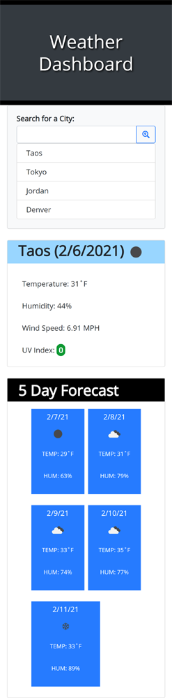
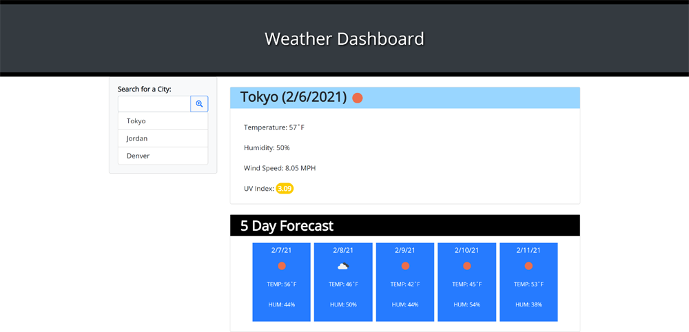

# Weather-Dashboard

For this assignment, I was tasked with creating a weather dashboard. This app runs in the browser and features dynamically updated HTML and CSS powered by jQuery, and by utilizing 3rd Party APIs.

I used 3 endpoints from the [OpenWeather API](https://openweathermap.org/api) to retrieve weather data for cities, including the current weather, the current UV index, and a 5 day forecast. 

I used the [Luxon](https://moment.github.io/luxon/) API to format dates that display. 

Below is the criteria I was to meet:

    * When a user searches for a city, they are presented with current and future conditions for that city and that city is added to the search history
    * When the user views the current weather conditions for that city, they are presented with the city name, the date, an icon representation of weather conditions, the temperature, the humidity, the wind speed, and the UV index
    * When the user views the UV index, they are presented with a color that indicates whether the conditions are favorable, moderate, or severe
    * WHEN the user views future weather conditions for that city, they are presented with a 5-day forecast that displays the date, an icon representation of weather conditions, the temperature, and the humidity
    * When the user clicks on a city in the search history, they are again presented with current and future conditions for that city

## Deployed Application Link:

https://bahuisken.github.io/Weather-Dashboard/

## Screenshots

- Mobile

- Desktop

## License

No License
